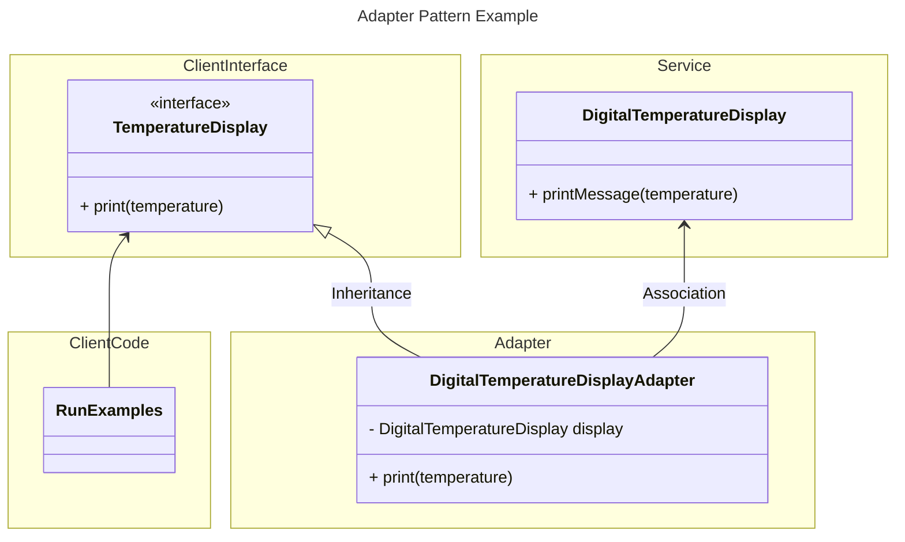
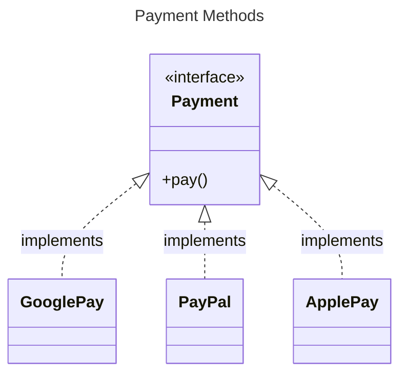
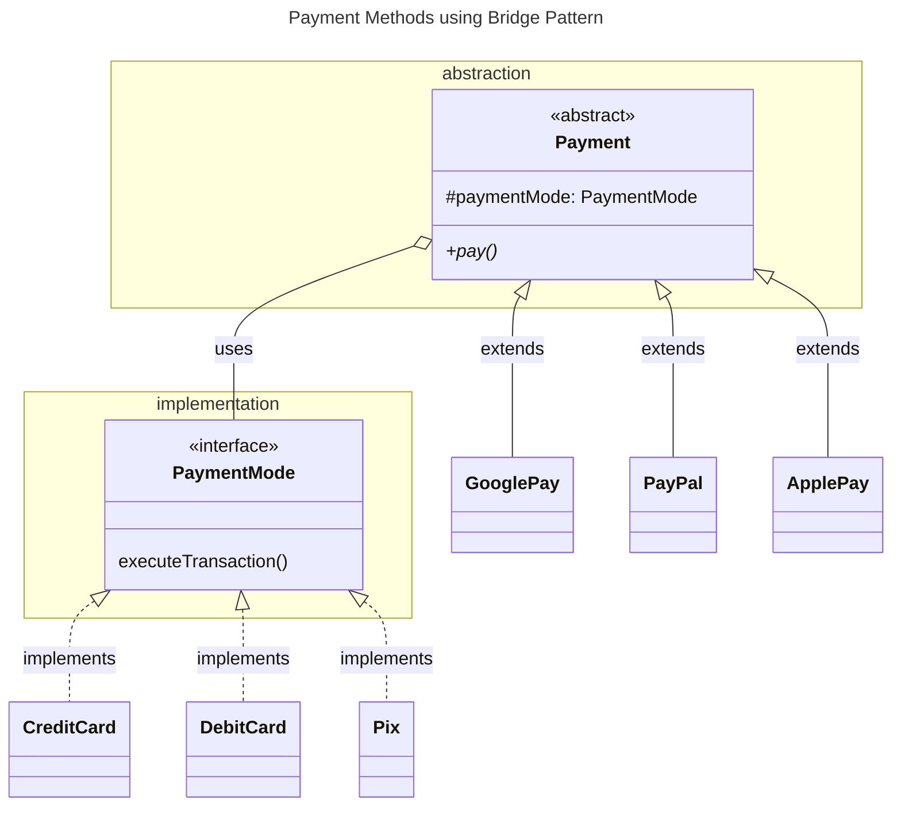

# Design Patterns Studies

## Creational Designer Patterns

As the [Classification of patterns from Refactoring Guru](https://refactoring.guru/design-patterns/classification) states
**creational** patterns provide object creation mechanisms that increase flexibility and reuse of existing code.

:bulb: - for all the patterns that will be presented below give a special attention to the **Applicability** section.

They are:
- [Factory Method](https://refactoring.guru/design-patterns/factory-method):
  - in the package `com.rochards.creational.factorymethod` there is a similar but slightly different approach to implement a factory method from [Factory Pattern in Java: Creating Objects with Ease](https://www.youtube.com/watch?v=iTfa97vXCAo) video.
- [Abstract Factory](https://refactoring.guru/design-patterns/abstract-factory):
  - in the package `com.rochards.creational.abstractfactory` there is a slightly modified implementation example from [The Abstract Factory Pattern Explained and Implemented | Creational Design Patterns | Geekific](https://www.youtube.com/watch?v=QNpwWkdFvgQ) video.
- [Come back to Builder later](https://refactoring.guru/design-patterns/builder):
- [Prototype](https://refactoring.guru/design-patterns/prototype):
  - this one is pretty straightforward and there is an implementation example following [this link](https://refactoring.guru/design-patterns/prototype/java/example)
- [Singleton](https://refactoring.guru/design-patterns/singleton):
  - in the package `com.rochards.creational.singleton` there are some examples created from [this link](https://refactoring.guru/design-patterns/singleton/java/example#lang-features)

## Structural Design Patterns

As the [Classification of patterns from Refactoring Guru](https://refactoring.guru/design-patterns/classification) states
**structural patterns** explain how to assemble objects and classes into larger structures, while keeping these structures 
flexible and efficient.

:bulb: - for all the patterns that will be presented below give a special attention to the **Applicability** section.

They are:
- [Adapter](https://refactoring.guru/design-patterns/adapter):
  - in Java `Arrays.asList(array)` method is an adapter implementation, because you pass an **Array** as the method argument and receives a **List**
  - in the package `com.rochards.structural.adapter` there is an example that I created to implement an Adapter pattern that implements the following diagram. Additional information is given in `RunExamples.java` class:

the **Client Code** above acquires some data from a sensor in Fahrenheit but can't use the `DigitalTemperatureDisplay` 
(that we're assuming is coming from some library) service immediately because the `printMessage(temperature)` method from 
that class only works with Celsius.

- [Bridge](https://refactoring.guru/design-patterns/bridge);
  - let's imagine that we have a `Payment` interface the current implementations are: `GooglePay`, `PayPal` and `ApplePay`. The diagram looks like this:

now we also would like to provide a way to pay with credit card, debit card or pix (payment method very common in Brazil). Now we end up with `GooglePayCreditCard`, `GooglePayDebitCard`, `GooglePayPix`, `PayPalCreditCard` ... and so on. You got the idea. This wouldn't be very practical.  
We may use the Bridge pattern to solve this problem using *abstraction* and *implementation* idea from this pattern.

there is a reduced implementation of the diagram above in the package `com.rochards.structural.bridge`.

- Composite;
- Decorator;
- Facade;
- Flyweight;
- Proxy;