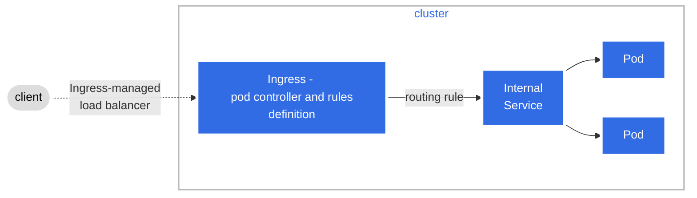
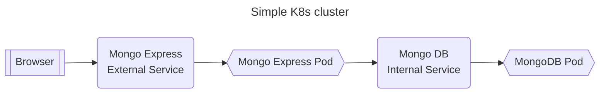

# Kubernetes Tutorial for Beginners [FULL COURSE in 4 Hours]

Course link: https://www.youtube.com/watch?v=X48VuDVv0do  
Git with a list of CLI commands using `kubectl`: https://gitlab.com/nanuchi/youtube-tutorial-series/-/blob/master/basic-kubectl-commands/cli-commands.md  

Quick reference with example to `kubectl` usage: https://kubernetes.io/docs/reference/kubectl/quick-reference/  
All `kubectl` commands: https://kubernetes.io/docs/reference/generated/kubectl/kubectl-commands

**Kubernetes**, also known as **K8s**, is an open source container orchestration tool.

## Tools needed to follow the course

- [minikube](https://minikube.sigs.k8s.io/docs/start/) - it will be used to create a single node k8s cluster on your machine. It will install all the necessary tools, including docker on the node.
- [kubectl](https://kubernetes.io/docs/tasks/tools/) - to manage the kubernetes cluster.

## K8s Architecture

Whenever you feel lost when encounter terms like Node, Pod, Deployment, or Service,  refer to the [K8s Glossary](https://kubernetes.io/docs/reference/glossary/?fundamental=true)

Here we have a picture showing a basic K8s cluster:


- **Pod** - a group of one or more containers. Think of Pod as a wrapper of a container. In K8s you deploy Pods not containers directly.
- **Node** - a worker machine (virtual or physical). Each Node must have the following components installed: 
    - **kubelet**: an agent/process that manages the Pods on the Node.
    - **kube-proxy**: a network proxy to ensure networks rules on the Node and also provide communication to the Pods.
    - **container runtime** e.g., Docker: represented and abstracted in the picture above by the Container Runtime Interface (CRI).
- **Control Plane** - previously known as **master node** is intended to run only K8s processes, and it's the "brain" of K8s cluster. The Control Plane runs:
    - **kube-api-server**: also known as **API Server**, it exposes the K8s API. When you use `kubectl` tool to manage the cluster, it  interacts with this component.
    - **scheduler** or **kube-scheduler**: basically this component takes a request from the API Server that new Pods are available to creation. The schedule then evaluates and selects a node for them to run on, and makes a request to the kubelet on the selected node to create the Pod.
    - **Controller Manager** or **kube-controller-manager**: it's a component that runs **controller** processes. Controllers are control loops that watch the state of your cluster, then make or request changes where needed. Ex.: if a Pod "dies" it will request the scheduler to create a new Pod. It's a very complex component to understand and I highly recommend exploring the documentation for [controllers](https://kubernetes.io/docs/concepts/architecture/controller/).
    - **cloud-controller-manager**: it also runs **controller** processes but they are specific to a cloud provider, like AWS.
    - **etcd**: a key-value store of the cluster state. Every information about K8s cluster, configuration, current state, desired state1 is stored in etcd.

## Layers of abstraction

- **Service**: a way to expose Pods over a network within the cluster and to external users. 
  - the `mongo-deploy/mongoexpress-deploy.yaml` file provides an example of how to configure an external service (gives access outside the cluster).
  - the `mongo-deploy/mongodb-deploy.yaml` file also provides an example of how to configure an internal service (only apps inside the cluster will be able to call the service).
- **Ingress**: it's a K8s component that manages external (recommended way) access to the services in a cluster. So Ingress and Service work together. Ingress exposes HTTP and HTTPS routes from outside the cluster to services within the cluster. Ex.:

only creating a ingress resource has not effect. You must have an **ingress controller**, e.g, [ingress nginx](https://kubernetes.github.io/ingress-nginx/deploy/), [AWS Load Balancer Controller](https://github.com/kubernetes-sigs/aws-load-balancer-controller)
- ReplicaSet;
- Pod;
- Container
- **namespaces**: namespaces provide a mechanism for isolating groups of resources within a single cluster. Some resources can't be isolated in a namespace, they live globally in the cluster, e.g, volumes and nodes. All resources that you create is on `default` namespace (you can create another one if you want to).
    - a good example of use of namespace is to have a **blue** and **green** namespaces for **blue-green** deployment
    - to list all resources delimited by a namespace: `kubectl api-resources --namespaced=true`
    - to list all resources not delimited by a namespace: `kubectl api-resources --namespaced=false`

## About the YAML files

Each configuration file consists of three parts:
- **metadata** - defined by you. Ex.:
```yaml
metadata:
  name: nginx-deployment
  namespace: my-namespace # it you want to avoid default namespace
  labels: ...
```
- **specification** - defined by you. Ex.:
```yaml
spec:
  replicas: 2
  selector: ...
```
- **status** - this one is generated and added automatically by K8s. It holds the status of your deployment and uses it to reach the desired state getting information from etcd Ex.:
```yaml
status:
  availableReplicas: 2
  conditions: ...
  replicas: ...
```
to check the information above just type `kubectl get deployment <deployment-name> -o yaml`.

## About the mongo-deploy folder

The intent of the YAML files in this folder is to accomplish the diagram below. You will access the MongoDB Express from your browser and the request will follow this flow:



Type `chmod +x deploy.sh` to give the file execution permission, and then run it to deploy the applications. The same might be done for the `destroy.sh` file.  
After deploy, you can type `minikube service mongo-express-service` to open mongo express on your browser.

## Creating ingress to expose kubernetes-dashboard

- to provide an ingress nginx controller in minikube type: `minikube addons enable ingress`.
- you'll find a Pod of ingress nginx controller running if you type: `kubectl get pod -n ingress-nginx`.
- you'll notice that there is available a **kubernetes-dashboard** namespace if you type: `kubectl get ns`.
- we need the **kubernetes-dashboard** internal Service that answers on port 80. To check the service, type: `kubectl get service -n kubernetes-dashboard`.
- now you just need to apply the `kubernetes-dashboard/dashboard-ingress.yaml` file by typing: `kubectl apply -f dashboard-ingress.yaml`.
- to check the created ingress and the associated IP address, type: `kubectl get ingress -n kubernetes-dashboard`.
- now you'll need to create a entry in `/etc/hosts` file mapping the IP address found above to the Host **dashboard.com**, e.g,: `192.168.49.2    dashboard.com`.
- now open the **dashboard.com** on browser and you'll be able to see the K8s dashboard

## Helm charts

According to the [official definition](https://helm.sh/), Helm is the package manager for Kubernetes. It's well-known convenient way to package YAML files and distribute them in repositories. For example, if you need prometheus deployed on your cluster, you don't need to make all configuration from scratch, you can use the [prometheus helm](https://artifacthub.io/packages/helm/prometheus-community/prometheus) for that.