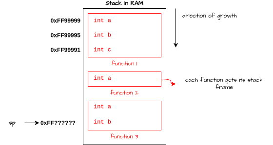

# Fundamentals of Operating Systems

My notes from [Fundamentals of Operating Systems](https://www.udemy.com/course/fundamentals-of-operating-systems) course.

## Table of content
- [Introduction](#section-1-and-section-2)
- [The anatomy of a process](#section-3-the-anatomy-of-a-process)
- [Memory Management](#section-4-memory-management)
- [Terminal commands for linux used through the course](#terminal-commands-for-linux-used-through-the-course)

## Section 1 and Section 2

They are just an introduction and an overview of what the course is about and why we may need an Operating System.

## Section 3: The anatomy of a process

### Process vs Program

A process is a program in motion/execution.

**Program**:
- Lives on disk;
- Code that is compiled and linked for a CPU;
- Only works on that CPU architecture when compiled;
- Produces executable file program, the so-called process;

Look at the format of a program in Linux systems:  
<div align="center">
  
</div>
ELF stands for Executable and Linkable Format.

:bulb: there is a simple code written in C in `code-section3` folder with the assembly `.s` file of this program compiled for a **x86_64** machine.

**Process**:
- Lives in memory;
- Is the program in execution;
- Uniquely identified by an ID, aka Process ID or just PID;
- Has a Instruction Pointer, aka Program Counter, that points to the memory address for the current instruction to be executed;
- Has PCB (Process Control Block), a region in kernel's memory that contains metadata information about the process.

Take a look on how a process lives in memory:  
<div align="center">
  
</div>
the arrows above mean that the Stack "grows down" and the Heap "grows up".


### Simple Process Execution

Initial considerations:
- In the image below we're considering that each instruction is at most 4 bytes long (32 bits architecture);
- `mov`, `add`, `str` are instructions;
- `r*`, `pc` (program counter), `ir` (instruction register) are CPU registers;
- The ELF header in the program tells the OS where to start the program;
- For simplicity, we're not considering the L* caches;

<div align="center">
  
</div>
the the execution of the remaining instructions happen the same way.

### The Stack

- The **stack pointer (sp)** is a register in the CPU the always points to the end of the stack.
<div align="center">
  
</div>

- The **base pointer (bp)** is also a register in the CPU to mark the start of the function; 
- *bp* always points to the last function in the stack. In the image above, *bp* would be pointing to the beginning of `function 3`;
- Moving up and down we must allocate and deallocate memory
<div align="center">
  
</div>
to deallocate it's just made the opposite of above. Sometimes the OS can make optimizations to save time and won't deallocate just one variable if the function is still in use.

Example on how memory is allocated in stack to call a new function:
<div align="center">
  
</div>

the **link register (lr)** also holds the main's return address for fast execution when `func1` returns. If `func1` calls another function, then *lr* is updated

**Summary**:
- The stack grows from high to low;
- It's used for function calls;
- Stack variables die quickly;
- The following registers where covered: *stack pointer (sp)*, *base pointer (bp)* and *link register (lr)*

**Curiosity section :nerd_face:**
- When a function returns, that portion of memory is not cleaned by the compiler. It all remains there and will be overwritten when another function is called;
- When a program compiles, the compiler goes through all the code, looks at all the functions, and 'decides' how much memory is required. It then tells the process to allocate this memory when it runs. Many optimizations are made, such as whether to allocate a variable in memory or keep it in registers (if there are enough);
- The kernel sets a default stack limit for every program. Of course, you can set compiler options to override this default when compiling your code. If the program exceeds this stack limit, it will encounter the infamous **stack overflow** error.


### The Data Section

- Fixed size portion in memory;
- Portion of the memory dedicated to:
  - Fixed size variables;
  - Global variables;
  - Static variables;
- All functions can access the variables from this region.

Take this code as an example:
```c
int a = 10;
int b = 20;

int main() {
  int sum = a + b;
  return 0;
}
```
the assembly code of that sum line would be something like this (read from bottom to up):
```arm
str r2, r1, r0
ldr r1 [#DATA, -4] ; load B
ldr r0 [#DATA, 0]  ; load A
```
think of `#DATA` as a pointer to the Data section.

**Curiosity section :nerd_face:**
- There are some languages, like Erlang, that allow you to change the text/code and data sections at runtime.


### The Heap

- Characteristics:
  - Large dynamic place for memory allocations;
  - All dynamic allocation happen here;
  - Memory must be explicitly freed by your program;
  - It grows from low to high addresses (it grows up);
- All functions can access data from the heap using **pointers**.
<div align="center">
  
</div>
variables in the DATA area can also point to values in the heap.

Code example in C language allocating memory in the heap:
```c
#include <stdlib.h>

int main() {
  int *ptr = malloc(sizeof(int)); // allocate memory

  *ptr = 10;
  *ptr += 1;

  free(ptr); // free the memory
}
```
I'm using a x86_64 architecture machine, so if I compile the code above to assembly, you'd be seeing system calls like `call malloc@PLT` to allocate memory and `call free@PLT` to free memory. Take a look at the `/code-section3/allocation-example.s`file

**Memory leaks**
- It happens when you, as a programmer, forget to free memory that you allocated. The function returns without calling the `free` syscall. If you don't explicitly tell the kernel that you don't need that portion of memory anymore, it remains allocated to your process.

**Dangling pointers**
-  A dangling pointer is a pointer that references a memory location that is no longer valid. Example:
```c
#include <stdio.h>
#include <stdlib.h>

void causeDanglingPointer() {
    int *ptr = (int *)malloc(sizeof(int));
    *ptr = 42;
    free(ptr); // ptr becomes a dangling pointer
    printf("%d\n", *ptr); // Undefined behavior: accessing memory after free
}

int main() {
    causeDanglingPointer();
    return 0;
}
```

**Performance**
- Due to the kernel mode switch (syscall involved) for allocation operations, it costs more to allocate memory in the heap than in the stack;
- Allocation in the heap is random, which leads to more frequent cache misses in the `L*` caches. This results in more trips to memory to fetch new data, which is also more costly.

**Escape analysis**
- If an object does not escape its scope (objects that are created and used within a single function or thread and do not "escape" that context), the compiler can allocate it **on the stack instead of the heap**, reducing the overhead of heap allocation and garbage collection. This make a lot of sense in languages like Java and Go.

**Program break**
- Is a pointer that represents the current end of the process's heap;
- When the process needs more heap, the program break is moved to a higher address to increase the heap size.

**Summary**
So, the heap:
- Stores large data;
- Remain until explicitly removed;
- All functions can access.

**Curiosity section :nerd_face:**
- Using c language we can:
  - Allocate memory in heap using the `malloc` function;
  - Deallocate memory using the `free` function;
  - Those functions make system calls, so the OS can do the memory allocation for your processes;
- Garbage collection in languages like Go and Java try to solve the problem of allocating and deallocating memory for the programmer;
- It's a good prevention strategy to set the pointer to `NULL` after freeing it to ensure it doesn't point to a freed memory location. Ex.: `free(ptr); ptr = NULL;`.

## Section 4: Memory Management

### The Anatomy of Memory

**Characteristics of memory**:
- Stores data;
- Volatile:
  - RAM - Random Access Memory
- Non-Volatile:
  - ROM - Read Only Memory

**Types of RAM**:
- SRAM - Static RAM:
  - 1 bit -> 1 flip flop circuit (5 or 6 transistors);
  - Access is always fast;
  - It's also used as caches in CPU and SSDs.
- DRAM - Dynamic RAM:
  - 1 bit -> 1 capacitor + 1 transistor;
  - Slower than SRAM;
  - SDRAM (Synchronous DRAM): the clock of CPU and RAM are synchronized;
  - DDR (Double Data Rate) :question: do some research for better understanding.

Take a look at a simplified example of reading from a **DDR4** SDRAM:
<div align="center">
  
</div>

- Each io pin gives 1 byte (8 bits) of information -> *64 pins x 1 byte = 64 bytes*;
- Because of the costing of reading, the CPU gets a total of 64 bytes (the CPU's cache line size) in response;

Take a look at a simplified example of reading from a **DDR5** SDRAM:
<div align="center">
  
</div>

- Each io pin gives 2 bytes (16 bits) of information -> *32 pins x 2 bytes = 64 bytes*;
- Because of the costing of reading, the CPU gets a total of 64 bytes (the CPU's cache line size) in response;
- :bulb: because of this idea of channels, as one CPU core is reading from channel A, the other core can read from channel B.

### Reading and Writing from and to Memory

Take a look at simplified example of reading from memory:
<div align="center">
  
</div>

- Note that after getting the 64 bytes, all the next instructions are already in the L caches, so there is no need to fetch from RAM again for a while;
- Also, note that if any instruction is a call to a function, it will be necessary to read from memory again, causing us to lose what we already had in the L cache. Because of that, calling too many functions in the code can lead to a decrease in code execution performance.

Take a look at simplified example of writing to memory:
<div align="center">
  
</div>

### Virtual Memory

**Fragmentation**

It happens when free memory are scattered in small blocks across the RAM, making difficult to allocate contiguous blocks of memory;
<div align="center">
  
</div>

- **External fragmentation**: the image above provides a great example of external fragmentation. There is free space available between blocks, but yet the memory can't fit a new process;
- **Internal fragmentation**: it happens when the blocks allocated are larger than needed, resulting in potentially free space available (because it is not being used by the process) inside the block. For example, if a process requests 18 bytes and the allocator rounds up to the nearest 32 bytes, 14 bytes are wasted within that block.

**Virtual Memory and Fragmentation**

- Let's use fixed block size and call it **page**;
- A **page size** is often 4 kB;
- Each process has virtual address space;
<div align="center">
  
</div>

- Note that when looking at the virtual memory, all the processes are alike;
- `A.P2` and `C.P1` show internal fragmentation, where that portion of the process doesn't need the whole page, but it is allocated anyway. However, this solves the external fragmentation problem.
- We map logical pages (virtual/logical addresses) to physical pages (physical addresses), and this information is stored in the **process page table**;
  - Page table is stored in memory;
  - Each process has it own page table that resides in somewhere in the kernel space;
<div align="center">
  
</div>

-
  - In the image above, VMA stands for Virtual Memory Address, and PA stands for Page Address, which is the physical address. Note that the page table only holds the initial address for each page. Considering that each page is 4 kB in size, the Operating System does the math to determine the ending address.

**Shared Memory**

- Let's consider a problem: a program generates 5 processes. There will be many regions in memory with duplicated text/code. So, with virtual memory, we load the text/code once and map all virtual addresses to the same physical addresses.
<div align="center">
  
</div>

- Another example: when a needed library is loaded for a program, if another program comes in and needs the same library, the OS just maps to the page where this library resides in memory for the new program's page table.

**Isolation**
- With direct access to physical addresses, processes could attempt to load an address they aren't supposed to. Virtual memory solves this issue by completely isolating each process.

**Swap**
- Large processes can't fit entirely in memory, so some virtual pages are put onto disk;
- This can also be used if there are too many processes and there is not enough RAM available;
- The OS will decide which pages to offload to disk;
- There is a bit in the mapping that indicates whether that particular page is on disk or in RAM;
- Remember, for the CPU, the data and code must be in RAM. So if the page isn't loaded in memory at that particular time, the OS will issue a page fault and load it from the swap file. The OS will also allocate new memory and update the new physical address in the mapping (because the page can be loaded anywhere in memory).

**Summary**
- Virtual memory addresses a lot of issues, like sharing memory, loading large processes, isolating processes, and external fragmentation;
- Virtual memory comes with the cost of using page tables and having page faults (a kernel mode switch is needed here);
- There is also an additional layer of translation with the MMU (Memory Management Unit), because the CPU can't read virtual addresses.

**Curiosity section :nerd_face:**
- To avoid the constant cost of reading from RAM for address translations, there is a TLB (Translation Lookaside Buffer), which is a cache for the page table.

**My Q&A of this section**:
- Does fragmentation only occur in physical memory? **A**: No! It also happens in virtual memory.
- What is the advantage of using virtual memory? **A:** We get rid of external fragmentation.
- Why is hard to share memory with physical memory? **A** This was easier accomplished using virtual memory.
- Memory allocation must be contiguous: should the whole process fit in a contiguous space, or can the Kernel divide it? **A**: Actually, the kernel divides the process into pages. From the perspective of virtual memory, the process appears as contiguous in memory, but it is divided in physical memory.
- What is the cost of using virtual memory in terms of performance? **A**: It's usually the same as reading from memory (~ `50 ns - 100 ns`), since the page table resides in RAM.
- Why processes need contiguous slots of memory? **A**: It's just a design choice that all existing OS agreed for simplicity. But remember that the process is contiguous only when we look at the virtual memory, but in physical memory the pages can be dispersed.
- Is the entire process divided into pages, including the stack and heap? Do they also appear as contiguous in virtual memory but can actually be scattered in physical memory? **A**: Yes for all questions.
- If the stack are scattered in physical memory, does this mean that the base pointer and stack pointer registers look at the virtual addresses? **A**: Yes everything points to virtual memory. When the actual execution is required the MMU is consulted to do the mapping to get the content. 
- Who decided that a page must be 4 kB? Is it a convention for all operating systems? **A**: Yes, it is a convention.

## Terminal commands for linux used through the course

To know more about any commands below, just use the `man <command-name>` in terminal. Ex.: `man uname`
- `uname -r`: shows the kernel version;
- `gcc -S <file-name.c> -o <file-name.s>`: to generate the assembly code in your current architecture from a `.c` file;
- `gcc -g <file-name.c> -o <file-name.s>`: to compile to machine code. The `-g` flag instruct the compile to include debugging information;
- `gdb <file-name>`: to debug a compiled program. And after you executed it, you may type:
  - `start`: to begin the debugging;
  - `n`: to execute the next code instruction;
  - `info registers`: to show the registers and current information held by those. :bulb: if you see a register pc or rip, those are the program counter (PC) or (Register Instruction Pointer).

## Curiosity
Average cost time from the CPU perspective to read data from:
| Source    | :hourglass: |
| --------- | ----------- |
| Registers | 1 ns        |
| L1 cache  | 2 ns        |
| L2 cache  | 7 ns        |
| L3 cache  | 15 ns       |
| RAM       | 100 ns      |
| SSD       | 150 ns      |
| HDD       | 10 ms       |

